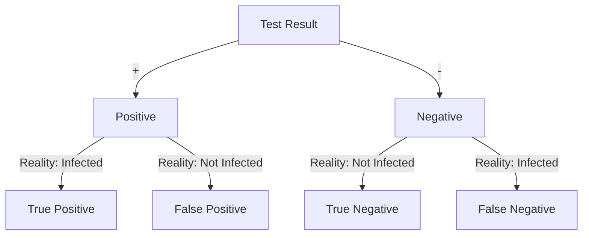
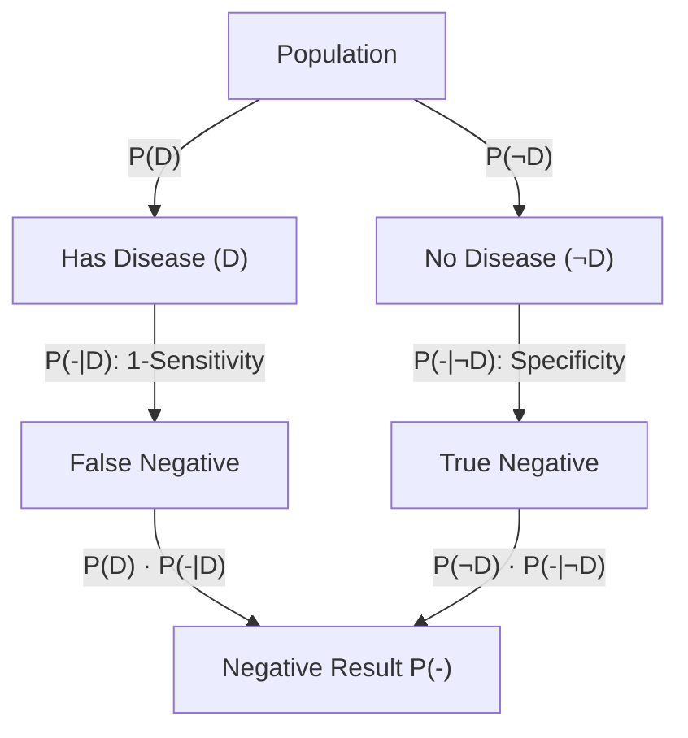

In this post, we explore Bayesian probabilities through the lens of the accuracies of medical tests. We show how Bayesian priors can
help refine our projections, and how to do this accurately.

<!-- {}
This post is about _math_ not _medicine_.
{} -->

{}
This post is for a mathematical discussion, not a medical discussion. The intent is to inform the reader about how
probability works in relation to tests that can have false positives/negatives. The author has no medical training nor
is this post intended to provide medical advice. It is hoped that the reader will better understand likelihoods of test
results in the context of the mathematics, not make medical decisions based on this post.


## Person X

Imagine Person X, who is exhibiting the beginnings of flu-like symptoms. They have heard on the news that COVID-19 is spreading locally. Person X purchases an over-the-counter COVID-19 rapid test, and they get a negative result. They are relieved that it is not COVID-19, and head off to their job. They think to themselves, _yes, maybe there is a small chance I'll give a coworker the flu, but I can't take a sick day unless I really need it, and this isn't COVID_.

Unfortunately, Person X isn't fully aware that medical tests can have false positives and false negatives, and that the over-the-counter tests tend to be somewhat less accurate than the more formal tests. The complexities of public education on these matters is far beyond the scope of this post, but if you were responsible for public health, you must make some tough choices in educating the public about the possible false negative or false positive results from testing. 

On the one hand, if you push a lot of cautionary information to the public, a number of individuals will form an opinion that _these tests aren't 100% accurate so why bother_, and the percentage of people who will make an effort to tests themselves will likely go down. On the other hand, by _not_ emphasizing the potential inaccuracies in these tests, you may get a higher participation rate from the public, but then you will also have cases such as Person X who may be spreading the illness under the impression that they are not infected due to a false-negative result.

How can we think about this carefully? This post is not medical instruction, but we can use data science tooling to help the average person better understand the complexities that public health officials face. 

## Definitions and grounding in reference

{}
In order to keep the mathematical discussion focused, we will have the following simplified assumptions:

* We assume for simplicity that only one over-the-counter test is available to the public in order to keep our calculations simpler, and assume all batches are equally accurate and that it doesn't ever expire. We also assume that the test accuracy remain unchanged for new strains, which is also not likely.
* We assume for simplicity the uniformity in PCR testing (the more accurate but slower test for COVID-19), that is, we assume every single test taken anywhere using any lab will have the same accuracy, and that no lab mistakes are made.
* We will ignore the variation in human biology and assume that every single person conducts the at-home-test in exactly the same perfectly accurate way. For example, we ignore the fact that some individuals will not swab well enough, and that some individuals may be more likely to give false positives due to genetic variation in how the disease may manifest, i.e. it may be possible that some individuals are more likely to get a predominantly lower respiratory tract infection with this disease, and some individuals may be more likely to get an upper-respiratory tract infection (in which case the rapid test may be more accurate).

__In reality, none of these assumptions hold true, and medical and public health officials have
to consider all of these complexities and many more.__
{}

As will always be the case in Data Science, we are considering a model of our world that aligns in some ways with ours, but is far simpler by necessity. 

{}
The art of Data Science is finding a key point at which we've added enough complexity to our model for it to provide actionable findings, but not so much complexity that our models are impractical to deploy and use. However, we must always remember that __these findings are only guaranteed to apply accurately to the world of our model, and thus we need to be careful in applying them without caution and testing to the world we live in.__
{}


With those caveats in mind, let's see what probability can tell us about our imagined Person X scenario. 
There are three main tests to determine if someone is positive for COVID-19, all of these tests have some tradeoffs:

| **Test Type** | **Pros** | **Cons** |
|---------------|----------|----------|
| **Rapid Test** | - Quick results, often within 15-30 minutes.<br>- Non-invasive testing method. | - Lower accuracy compared to PCR, higher chance of false negatives.<br>- Less effective in detecting the virus early in infection. |
| **PCR** | - High accuracy and sensitivity.<br>- Considered the gold standard for detecting active infections. | - Results take longer, typically 1-3 days.<br>- More invasive and may require specialized facilities. |
| **Antibody** | - Can detect past infections and immune response.<br>- Useful for seroprevalence studies. | - Not very useful in detecting active infections.<br>- Takes 1-3 weeks after infection to develop detectable levels of antibodies. |

For all three types of tests, we can find multiple examples in the literature which have measured the accuracy of these tests, but of course, all of these studies are snapshots in time. As new strains become prevalent, the accuracy rate of, say, the Rapid Test, may drift. Additionally, given that research and data is never crystal clear, some of these studies disagree. For example, a study published in BMJ in 2022 found a substantially higher false positive rates with rapid testing than prior studies (Mulchandani et al)[^Mulchandanim4262] had found. Data is rarely clean, there is rarely a solid answer to questions we have to ask about our models, and so we sometimes have to make careful judgment calls on what data we should include or not.

[^Mulchandanim4262]: Mulchandani et al., _Accuracy of UK Rapid Test Consortium (UK-RTC) AbC-19 Rapid Test for detection of previous SARS-CoV-2 infection in key workers: test accuracy study_, BMJ, 371, 2020, doi [10.1136/bmj.m4262](https://www.bmj.com/content/371/bmj.m4262)

{}
We are using a single study here to ground our discussion in numbers. In no way should this single study be seen as the final source of truth, nor should the reader take numbers presented from this study as accurately applying to all tests. The reader is encouraged to conduct further research if they wish to be a part of any debates on the accuracy of these tests and how to present accuracy data to the public.


The results summary in this journal article are informative to our discussion. We can very clearly see here why these fine probabilistic details aren't part of public-health's general public messaging. We will include as an exercise at the end of this chapter a request that the reader attempt to fashion a public-health message under the assumption that these findings are correct and replicated, which could in fact include a choice to not mention them at all. Their results summary reads (Mulchandani et al)[^Mulchandanim4262]:


> Test result bands were often weak, with positive/negative discordance by three trained laboratory staff for 3.9\% of devices. Using consensus readings, for known positive and negative samples sensitivity was 92.5\% (95\% confidence interval 88.8\% to 95.1\%) and specificity was 97.9\% (97.2\% to 98.4\%). Using an immunoassay reference standard, sensitivity was 94.2\% (90.7\% to 96.5\%) among PCR confirmed cases but 84.7\% (80.6\% to 88.1\%) among other people with antibodies. This is consistent with AbC-19 being more sensitive when antibody concentrations are higher, as people with PCR confirmation tended to have more severe disease whereas only 62\% (218/354) of seropositive participants had had symptoms. If 1 million key workers were tested with AbC-19 and 10\% had actually been previously infected, 84,700 true positive and 18,900 false positive results would be projected. The probability that a positive result was correct would be 81.7\% (76.8\% to 85.8\%).


In the next section, we'll take a deeper dive into what this results summary may mean.

### Definitions

#### Test results

First, let's define some of the words used here that may be unfamiliar to those starting off in data science.

<div class="td-content" style="text-align:center">


</div>

{}
We will define these in the context of our current discussion about epidemiology.
Suppose a test can have two results: positive or negative. Suppose that these results map with some accuracy to a corresponding state, such as infected or not-infected. Then we can define the following terms:

- **True Positive (TP)**: When a test result is positive, and the reality is that the person **is** indeed infected.

- **False Positive (FP)**: When a test result is positive, and the reality is that the person is **NOT** infected.

- **True Negative (TN)**: When a test result is negative, and the reality is that the person is **NOT** infected.

- **False Negative (FN)**: When a test result is negative, and the reality is that the person **is** indeed infected.


#### Conditional Probability

Suppose we wish to find out the probability that someone is actually infected when they have tested negative.

Conditional probability is defined as: 


<div class="td-content">
  <div class="inner-wrapper">
    <div class="venn-container">
      <div id="venn" class="venn-diagram"></div>
      <div class="equation">
        $$ A \cap B = \{x \in \mathcal{U} \mid x \in A \text{ and } x \in B\}$$
        $$ P(B|A) = \frac{P(A \cap B)}{P(A)}$$
      </div>
    </div>
  </div>
</div>

<script src="/js/d3.v4.min.js"></script>
<script src="/js/venn.js"></script>
<script>
  var sets = [
    {sets:["A"], size: 12},
    {sets:["B"], size: 12},
    {sets: ["A", "B"], size: 4, label: "A ∩ B"},
  ];
  var chart = venn.VennDiagram()
    .wrap(false)
    .width(250)  // Adjust width to fit within the container
    .height(250);  // Adjust height if necessary
  var div = d3.select("#venn").datum(sets).call(chart);
  div.selectAll("text").style("fill", "white");
  div.selectAll(".venn-circle path").style("fill-opacity", .6);
</script>

<style>
.inner-wrapper {
  display: flex;
  justify-content: center;
  align-items: center;
  width: 75%;
  box-sizing: border-box;
}

.venn-container {
  display: flex;
  justify-content: center;
  align-items: center;
  width: 100%;
  box-sizing: border-box;
  flex-wrap: wrap; /* Allows wrapping for smaller screens */
}

.venn-diagram {
  flex: 0 1 auto;
  max-width: 250px;
  box-sizing: border-box;
}

.equation {
  flex: 0 1 auto;
  text-align: center;
  margin-left: 20px;
  box-sizing: border-box;
}

/* Media query for mobile screens */
@media (max-width: 768px) {
  .venn-container {
    flex-direction: column; /* Stack items vertically */
  }

  .equation {
    margin-left: 0;
    margin-top: 20px; /* Add spacing between stacked items */
  }
}
</style>

* Consider a sample of two people whom we can definitively divide into a group whose test result was _negative_ (group A) and those who were actually _positive_ (group B). The group A might be those whose rapid test claimed negative, the group B might be those whose antibody test later showed they were actually infected.

* \\(A \cap B\\) is the intersection of group A with group B, that is, people who belong to both groups--people whose rapid test said negative but were actually positive, i.e. the False Negative group.

* \\(P(B | A)\\) is the mathematical way of stating the probability of being in group B (infected) _given_ that one is _also_ in group A (tests negative).

* We define \\(P(B | A)\\) as the ratio \\(P(B \cap A)\\) over \\(P(A)\\)

* Hence, intuitively, the probability that of any randomly selected person in group A (test negative) are also in the pool B (is infected) is equal to the portion of people \\(A \cap B\\) that overlaps with the entire pool A.

* This assumes a very large ensemble of people selected to study in either group, this doesn't work reliable for smaller sample sizes.

#### Sensitivity, Specificity, and Accuracy

We now present some standard definitions:

{}

Portion of test results which gave a true positive result out of the pool of all test subjects who were in fact infected (those who were infected and got an accurate positive result are TP, those who were infected but got a negative result were FN, the sum TP + FN gives us the total that was in fact infected). The probability is written as the probability of getting a positive result \\(P(+)\\) given "|" that they are indeed infected \\(P(D)\\):

$$ P(+|D) = \frac{\text{TP}}{\text{TP} + \text{FN}} $$

{}

{}
Portion of test results which gave a true negative result out of the pool of all test subjects who were in fact __NOT__ infected (those who were __NOT__ infected and got a positive result are FP, those who were __NOT__ infected and got an accurate negative result were TN, the sum TN + FP gives us the total that was in fact __NOT__ infected). The probability is written as the probability of getting an negative result \\(P(-)\\) given "|" that they are not infected \\(P(\neg D)\\):

$$ P(-|\neg D) =  \frac{\text{TN}}{\text{TN} + \text{FP}} $$
{}

{}
Portion of all test results that were correctly identified, either as positive or negative, out of the total number of tests conducted. This includes both true positive results (TP, those who were infected and got an accurate positive result) and true negative results (TN, those who were __NOT__ infected and got an accurate negative result), divided by the total number of tests, which is the sum of true positives (TP), false positives (FP, those who were __NOT__ infected but got a positive result), true negatives (TN), and false negatives (FN, those who were infected but got a negative result).
$$ \frac{\text{TP} + \text{TN}}{\text{TP} + \text{TN} + \text{FP} + \text{FN}} $$
{}

{}
In what follows, we will be treating this equation and other like it as if this equivalence were true:

$$ \text{Specificity} = P(\text{TN}|\neg D) = P(-|\neg D) $$

In the context of disease as we are discussing it here, this equivalence is valid. Please note, though, that for more complicated discussions on probability, this equivalence may not hold. 
{}


### Analysis of journal article

Given the above definitions, we can examine this statement of the results from our example reference (Mulchandani et al)[^Mulchandanim4262]:

> Using consensus readings, for known positive and negative samples sensitivity was 92.5\% (95\% confidence interval 88.8\% to 95.1\%) and specificity was 97.9\% (97.2\% to 98.4\%).


By consensus readings, the protocol they describe entailed having three readers evaluate each test (Mulchandani et al)[^Mulchandanim4262]:

> If the three independent readers disagreed on the positivity of a sample, the majority reading was taken as the “overall” or consensus test result in our primary analysis, as per the WHO protocol.

To determine who was true positive, the researchers used the baseline of truth for this consensus reading analysis to be "participants who had had a positive PCR test for SARS-CoV-2'' (Mulchandani et al)[^Mulchandanim4262]. The PCR test, while more accurate than a rapid test, itself lacks perfect accuracy, so this and other systematic potential errors results in a uncertainty interval. Here's a quick summary of their sensitivity findings:

{}
- *Rapid Test Sensitivity* when baseline for true positives was self-reported PCR positives alone: ≈92.5%
- *Rapid Test Sensitivity* for those who had confirmed PCR positives when baseline for true positives was antibody blood test: ≈94.2%
- *Rapid Test Sensitivity* for those who had no PCR test and hence had an unknown infection status, when baseline for true positives was antibody blood test: ≈84.7%
{}

So what's happening here? One explanation the researchers propose is that those individuals who had a more intense infection were more likely to experience more intense symptoms and more likely to get a PCR test. And since Rapid Tests are shown to be more accurate for those with more intense symptoms, and having more intense symptoms makes getting a PCR more likely (due to the inconvenience and discomfort of these tests as compared to Rapid Tests, those with fewer or less intense symptoms are less likely to make the effort), it then makes sense that these tests have higher sensitivity for those who got the PCR test. In the words of authors (Mulchandani et al)[^Mulchandanim4262]:


> This is consistent with AbC-19 being more sensitive when antibody concentrations are higher, as people with PCR confirmation tended to have more severe disease whereas only 62% (218/354) of seropositive participants had had symptoms.

That is, of their sample group with whom they were certain had been positive due to the seropositive (anti-body blood test), only 62% had
displayed symptoms. That leaves a large group of people who might have shown no symptoms and did not know they were exposed, and those who had no symptoms, knew they were exposed, but either didn't bother getting tested due to lack of symptoms or simply took a rapid test.


## Synthesis

Let's imagine for a moment the unenviable task of being in charge of public health messaging. How might you relate the prior discussion to the general public? (Please note, in reality you would want to synthesize many journal articles that replicate each other, but when there is a new virus on the scene, often one has to work with just the first to publish and decide whether or not to act on that information before replication is achieved by other labs). 

We can look at how some of this information was handled at the time. One example dated from August 2020 (well before the above journal article was published) was that the US FDA advised at the time that rapid test should not be given to people _without_ symptoms (Mulchandani et al)[^Mulchandanim4262]:

>People without symptoms of COVID-19 who haven’t been exposed to the virus shouldn’t get rapid tests to see if they are infected, according to guidance Friday from the Food and Drug Administration.

>The guidance, added to the agency’s website, says that instead, highly sensitive tests, known as PCR tests, should be used for such individuals — if turnaround times are fast enough. These lab-based tests are known to be more accurate, but take hours to complete. Recent backlogs across the country have left some people waiting upward of 10 days for results.

At the time, rapid tests were approximately the same cost as PCR tests. From the University of Chicago News we can find a more recent recommendation from Assoc. Prof. Emily Landon \cite{UChicagoNews2020RapidCOVIDTest}:

>Rapid antigen tests – which you can buy in most pharmacies, big box stores and online retailers, are an excellent choice – but you may need to take multiple tests. Rapid antigen tests detect COVID-19 when people have a higher amount of virus particles in their system and are more contagious. But a negative antigen test doesn’t necessarily mean you don’t have COVID-19. Trust a positive antigen test, but be more skeptical about a negative one.

### Discussion of journal article

We agree with the journal authors that it is advisable to "trust a positive [rapid test]", even though the sensitivity has been found to be potentially as low as 84.7% for the test in question at the time of testing. We can argue from a public good perspective that this is an excellent example of public health messaging:

* Firstly, we have to accept that the scientific education of the general public is on a spectrum, and that the vast majority of the public lacks scientific education beyond what was provided in public schooling. This is not to sound elitist, but we have to understand our audience and what an audience may _hear_ from their perspective. 
* If enough of the public starts to think that because of their imperfections, the rapid tests aren't worth taking, then a powerful tool for slowing the spread of infection is reduced. 
* For those who might have a non-Covid infection, such as a cold, and test positive with the rapid test, the likely worst outcome of the false positive is that they take extra precautions to not spread their infection.
* On the other hand, if they were actually positive and dismiss the test's positive results, they could potentially infect individuals who are vulnerable to severe disease, or at least be more likely to spread the disease than otherwise. 

So instead of saying to the public:  "If you test positive with a rapid test, you have an approximately 90% chance or so that you actually have COVID-19," a simple straight-forward message to "trust the positive result" likely maximizes the public good.

On the other hand, although the specificity (portion of negatives that are true negatives) for these tests is fairly high, this is partially due to the fact that in the pool of test subjects, the vast majority of the subjects will not have COVID-19, and since the total number of False Positives will be small portion of the already relatively small number of positives, True Negatives will dominate the specificity equation; or to think about it in terms of limits:

$$ \lim_{TN \rightarrow \infty} \frac{TN}{TN + FP} = 1 $$

Things bring us to an important remark:

{}
When evaluating the values of sensitivity and specificity, be mindful of the proportions of the pool being analyzed. For example, if a test is administered to a population of 1000 where only one single person is infected, and the test captures that positive and also gives a single false positive, then specificity becomes:
$$ P(-|\neg D) =  \frac{\text{TN}}{\text{TN} + \text{FP}} = \frac{999}{998 + 1} = 1$$
That is, everyone who was negative was measured to by the test, but the sample size is so small that this measure is unlikely to be a reliable projection for a larger population.

Similarly, sensitivity becomes:
$$ P(+|D) = \frac{\text{TP}}{\text{TP} + \text{FN}} = \frac{1}{1 + 0 } = 1 $$
However, these numbers are practically worthless because the sample set was so heavily unbalanced and there isn't enough subjects to form a clear statistical picture.

Neither of these measures reflect that we had a single false positive, although accuracy would:

$$ \frac{\text{TP} + \text{TN}}{\text{TP} + \text{TN} + \text{FP} + \text{FN}} = \frac{1 + 998}{1 + 998 + 1 + 0} = 0.999 $$

But again, given the small sample size, these numbers are not likely to hold up upon replication with a larger sample size. 
Statistics is about forming conclusions based on incomplete data, but there is a limit at which data is too incomplete to draw
conclusions. How that limit is determined is beyond the scope of this post.
{}

However, in the study cited, and a multitude of other studies, the results are statistically significant enough that we can, with some confidence, examine real world scenarios with the context of these findings. Let's return to our case of Person X and examine their situation given these numbers and assumptions above.

### Example

{}

>Suppose the Person X we started this post with, who has symptoms consistent with cold/flu/COVID-19, took a rapid test and got a negative result. What are the chances that Person X got a false negative and is indeed infected with SARS-COV-2?

In the following discussion, D is short for disease, such that \\( P(D) \\) is the probability that someone who exhibits certain symptoms has the disease in question, in this case, COVID-19, vs having some other disease \\(P(D')\\), say, a flu. 

Given the following assumptions and definitions:
- Prevalence Rate of COVID-19 in the population of those currently exhibiting cold and flu symptoms (Prior Probability, P(D)): 35%. This means that of all the people displaying cold and flu symptoms, 35% will have COVID-19, the remainder will have some other virus. I've randomly selected the number 35% for the sake of this example, in reality this number will vary by region and current viral trends. It is also impossible to determine this number precisely since a number of individuals who are showing such symptoms do not get sick enough to enter the medical system for testing, and for many viruses people might get effected and have minimal or no symptoms (asymptomatic) and be missed entirely.
- Sensitivity (True Positive Rate, P(+|D), the probability of getting a positive result given that the person does have the disease): 84.7%.
- Specificity (True Negative Rate, P(-|¬D), the probability of getting a negative result given that the individual does not have the disease): 97.9%.
- \\(P(-|D)\\): The probability of getting a false negative result given that the individual does have the disease (1-sensitivity).
- \\(P(D|-)\\): The probability of the tested individual to have the disease given a negative test.


Let's start by calculating \\(P(-)\\), the probability of any member of the subject population receiving a negative test result from the rapid test (without knowing whether they have the disease or not). There are two probabilistic pathways for them to fall into this group. The first is that they don't have the disease and get a True Negative result from the test. The other pathway is that they have the disease but get a False Negative.

<div class="td-content" style="text-align:center">


</div>

The probability of getting a negative result is thus
the sum of the probability of having the disease but getting a false negative given that one has the disease, 
\\(P(D) \cdot P(-|D)\\), plus the probability of not having the disease
and getting a true negative result given that one does not have the disease, \\(P(\neg D) · P(-|\neg D)\\).

This gives us the equation

```math
\begin{aligned}
P(-) &=& P(\neg D) \cdot P(-|\neg D) + P(D) \cdot P(-|D) \\
 &=& \left(1 - P(D)\right) \cdot P(-|\neg D) + P(D) \cdot \left(1 - P(+|D)\right)\\
&=& (1-0.35)(0.979) + (0.35)(1-0.847) \\
&=& 0.6899
\end{aligned}
```

So for our Person X, we would like to know: __given a negative test__, what is the probability that they actually __do__ have COVID-19? That is, we would like to estimate \\(P(D|-)\\). By the definition of [conditional probabilities](#conditional-probability):

<!-- $$ P(D|-) = \frac{P(D \cap -)}{P(-)} = \frac{P(D)\cdot P(-|D)}{P(-)}$$ -->
<!-- 
As we calculated \\(P(-)\\) prior, we saw that one term contained \\(P(\neg D)\\) and hence that term is excluded from the intersection of \\(P(D)\\), giving us -->

```math
\begin{aligned}
P(D|-) &=& \frac{P(D \cap -)}{P(-)} \\
&=& \frac{P(D)\cdot P(-|D)}{P(-)} \\
&=& \frac{ P(D) \cdot \left( 1 - P(+|D)\right) }{P(-)} \\
&=& \frac{0.35 \cdot (1-0.847)}{0.6899}\\
&=& 0.0776
\end{aligned}
```

That is, in this given scenario, assuming the numbers above, the probability that Person X has the disease despite the
fact that their rapid test came back negative is around 7.76%. __Important: This number is particular to the scenario we imagined above, but is in no way representative for every case. For example, we picked a random percentage for \\(P(D)\\). Please do not use these numbers to make real world decisions or arguments. This was for demonstrative educational purposes only.__

{}

## Bayes' Theorem

The above equation second line in the above question is known as Bayes' Theorem, which is generically written:

$$P(A | B)=\frac{P(A) \cdot P(B | A) }{P(B)}$$

## Discussion

We can visualize the situation with a Sankey diagram. Here we exaggerate the percentage of false positives and negatives for visual purposes. As can be seen, those who are infected but obtain a negative test and then do not self-isolate join the uninfected in non-isolation allowing the virus to spread and underlining the importance of accurate tests. However, the test results are accurate enough to catch the majority 
of people who are genuinely infected, and hence, reduces the rate of spread.


* This Bayesian analysis demonstrates that, under the given assumptions, an individual with symptoms who tests negative with a rapid COVID-19 test sometimes has a low but non-trivial probability of being actually positive for the virus.

* However, diseases aren't just the story of an individual, they are fully stories of an ensemble of individuals.

* So instead of saying that in this imagined scenario, Person X has a 7.76% chance of actually having COVID-19 despite the negative rapid test, we would more accurately have summarized it as follows: 
  * _Given these (guessed) assumptions, including the test accuracy rates and prevalence of COVID-19 among those exhibiting flu or cold like symptoms, on average 7 to 8 out of every 100 people chosen from the wider population who have symptoms of a respiratory illness but test negative with this rapid test will in fact be positive and potentially capable of spreading the disease._ (__Again, please note that these numbers are not to be used in the real world, this is meant to demonstrate a first pass at calculating these probabilities.__)


* Hence we see the public health messaging challenges for scenarios such as this, where we need to underline the imperfections of the test in order to instill some caution in the public regarding negative tests results, while maintaining public trust in the positive results so that the population continues to take them seriously and self-isolate. 
* Ultimately, the work of public health comes down to __minimizing__ the total number of deaths balanced against the negative impacts of public health mitigation efforts. It is a tough job, but one that benefits from public communications that are straight-forward to understand by the general population.
* Understanding how these probabilities are calculated can help individuals spot misinformation.

It is a tough job, with no easy answers, and as is typical in statistics, there is never any perfect certainty. Accepting that this is true for almost every decision that must be made in human societies doesn't mean we just give up and let what happens happen. It means we do our very best with the limited information we have, and constantly refine our approach as more information is obtained.