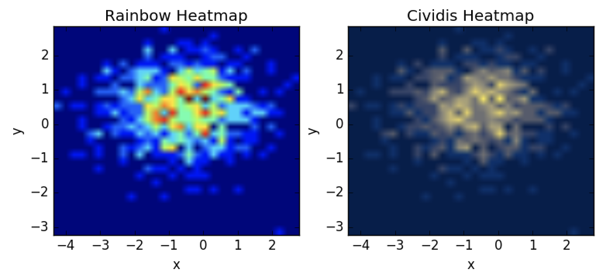

Heat maps have become quite common in data science, and in science in general, and for good reason. For those who can see them, they succinctly summarize patterns in data. There are many color schemes used in the wild, with the Rainbow scheme being one of the more common ones.

A group at [Pacific Northwest National Lab](https://www.pnnl.gov/) has recently published a [PLOS One article](https://arxiv.org/pdf/1712.01662.pdf) (hat tip [Scientific American article](https://www.scientificamerican.com/article/end-of-the-rainbow-new-map-scale-is-more-readable-by-people-who-are-color-blind/)) outlining their efforts to use mathematical modeling and the science of vision to create color maps for plots such that the exact same information is conveyed to those with and without color blindness.

The goal of this blogpost is to demonstrate a quick way you can utilize their results in your own graphs (if you use Python). Interested readers can follow the links above for more detail on their methodology. What follows below is enough to get you off the ground using their Cividis colormap right away. Here is a sample of the difference one can get using Cividis:



The sample above is just a starting point. More sophisticated examples of the use of Cividis can be found in the corresponding library and the above reference article.


## Installing the Library

{}
UPDATE Sep 13 2018:

The PR has been merged and you can just install with `pip install cmaputil` without having to pull the branch.

{}

PNNL's `cmaputil` library can be downloaded from their [github](https://github.com/pnnl/cmaputil) page or installed via `pip install cmaputil`. However, for the use cases I'm showing here, that won't quite work. [This PR](https://github.com/pnnl/cmaputil/pull/3) shows why. If that PR has been merged, or an alternative fix merged, you should be able to use the library from the source. If not, here is a quick work around:

```bash
git clone https://github.com/tdj28/cmaputil
git checkout -b patch-1
git pull
cd cmaputil
python setup.py install
```

Assuming that works, you can now use the camputil library to use optimized Cividis colormaps.

## Using Cividis


We would start by importing the key libraries:

```python
import cmaputil as cmu
import cmaputil.cvdutil as cvu
import scipy
```

Next, add the following section to your code. It modifies
the viridis colormap that comes with matplotlib and runs
some optimizations on it.

```python
# Input colormap nam
cmap = 'viridis'

# Optimize
rgb1, jab1 = cmu.get_rgb_jab(cmap) # Original colormap
rgb2, jab2 = cmu.get_rgb_jab(cvu.get_cvd(rgb1)) # CVD colormap
jab3 = cmu.make_linear(jab2) # Uniformize hue (a' vs. b')
#print(jab3)
_, jab4 = cmu.correct_J(jab3) # Linearize J'

# Convert back to sRGB
rgb4 = cmu.convert(jab4, cmu.CSPACE2, cmu.CSPACE1)
rgb4 = np.clip(rgb4, 0, 1)

# Resimulate CVD in case corrections took the map outside CVD-safe space
rgb4 = cvu.get_cvd(rgb4)


# Resimulate CVD in case corrections took the map outside CVD-safe space
rgb4 = cvu.get_cvd(rgb4)

colors = []
for j in range(len(rgb4[0])):
    colors.append( (rgb4[0][j],
                 rgb4[1][j],
                 rgb4[2][j]) )

# Convert to matplotlib colormap
cividis = mpl.colors.LinearSegmentedColormap.from_list("", colors)
```

Finally, you can easily incorporate it into your matplotlib plots as in the following example:

```python
plt.clf()
fig =  plt.figure(figsize=(9, 9))
plt.title('Cividis Heatmap')
plt.ylabel('y')
plt.xlabel('x')
im = plt.imshow(heatmap, extent=extent, cmap=cividis, origin='lower')
fig.colorbar(im)
plt.savefig('Cividis Heatmap')
```

We can compare the rainbow version of the above plot:


with the Cividis version:


It certainly may be a matter of preference for most folks. I find the Cividis version more appealing, for example, because although the dark reds pop to me and pinpoint "hot spots" perhaps a little more quickly, they appear to be almost detached from the rest of the heat blob. In the Cividis mapping, as in other mappings which have only two colors, the spectrum is clearer. Given that using Cividis ensures that any color blind readers will be getting the same information as I see seals the deal for me and makes Cividis my go to choice for colormaps going forward.

## Conclusions

* Cividis is an optimized version of the viridis colormap which optimizes for both the ability to discern patterns for those with normal vision and the ability of the color blind to see the exact same thing.

* Cividis works in Python and they also have an R library. This quick blog note shows how to use it _right now_, but I anticipate and hope that it will become obsolete and matplotlib will incorporate Cividis and PNNL's work on this. COMSOL Multiphysics, a finite element analysis software package, for example, will be doing so.

* You can find a standalone python script which I used to create these plots using Cividis [here](https://github.com/3implieschaos/various/blob/master/2018/20180819/heatmap.py)
