# Exploring Wikipedia page counts via additive models for seasonality decomposition

## Introduction

Wikipedia, in addition to being quite valuable as a *starting* point for many student essays (as somebody who has spent time in front of the classroom, I can't emphasize the word *starting* enough here), can provide some sociological insight by providing page count hits. In this brief blog entry, we will explore two python-ready implementations of additive models for seasonality decomposition in the context of the following topic:

* Is there any seasonality with wikipedia page hits? For this question, we will look at a few keywords which we think are quite often used by school students in researching for common essay questions (e.g. Abraham_Lincoln) and other keywords which are less likely to be commonly used by students for essays at any level, for example, the American telecommunications company Sprint.

This blog entry is posted in the form of a Jupyter Notebook so that readers can recreate the findings and pursue further questions more easily.

We use two _additive model_ implementations, one from a library called [statsmodel](https://www.statsmodels.org/stable/index.html) and another from a library developed by Facebook called [prophet](https://facebook.github.io/prophet/).

## Additive models for seasonality decomposition, a quick primer

Let's begin by creating a artificial time series.

Before importing pandas, numpy, etc., I want to turn off some typical warnings that we see from these libraries. This is just to keep the output looking clean for presentation purposes.


```python
import warnings
warnings.filterwarnings("ignore", message="numpy.dtype size changed")
warnings.filterwarnings("ignore", message="numpy.ufunc size changed")
warnings.filterwarnings("ignore",category=FutureWarning)
```

Next, we import all of the great Python libraries. Here, for seasonal decomposition we are using statsmodel and Facebook's Prophet.


```python
import pandas as pd
import numpy as np
import matplotlib.pylab as plt
import datetime
%matplotlib inline
from matplotlib.pylab import rcParams
import seaborn as sns
from statsmodels.tsa.stattools import adfuller
from statsmodels.tsa.seasonal import seasonal_decompose
from fbprophet import Prophet

rcParams['figure.figsize'] = 16, 7
```

Next, let's create a fake data set.


```python
entries = 365 * 2 # Two years worth of days
df = pd.DataFrame(np.random.randn(entries)).cumsum()
df.head()
plt.plot(df[0].tolist())
plt.show()
```


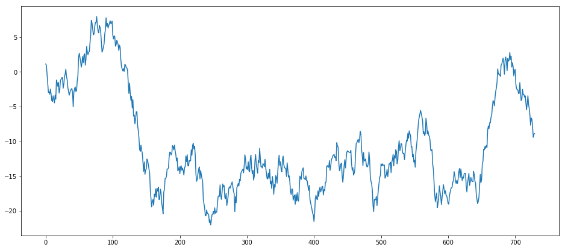


Our brains have pattern-matching algorithms trained over billions of years, so even though the above data set is a random walk, we may see patterns there anyway. If we run it again, those patterns will change even though we were using the exact same algorithm to generate them. This of course doesn't imply that finding patterns in data is an empty task, there is very often patterns that are legitimate. The point here is to show how the additive model works by throwing something known to be random at it. Just to show, again, how entirely random the generated dataset is, let's throw a bunch in the same graph:


```python
def rwts(entries=100):
    _df = pd.DataFrame(np.random.randn(entries)).cumsum()
    start = datetime.datetime.strptime("20160101", "%Y%d%m")
    dates_generated = [start + datetime.timedelta(days=x) for x in range(0, entries)]
    dtse = pd.Series(dates_generated)
    _df['ds'] = dtse
    _df = _df.rename(columns={0: "y"})
    _df.index = _df['ds']
    return _df
```


```python
entries = 365 * 2 # Two years worth of days
rwdf = []
for i in range(0, 10):
    rwdf.append(rwts(entries))
    plt.plot(rwdf[i]['y']) #.tolist())

plt.show()
```


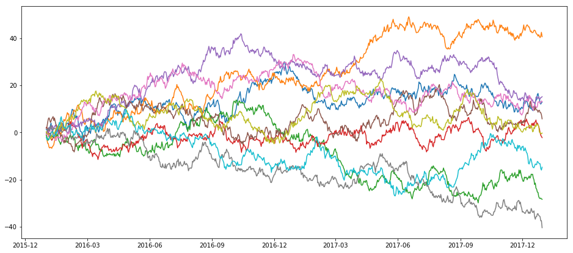


Next, let's see what happens when we apply the statsmodel implementation of the additive model to a random walk dataset:


```python
def additive_seasonal_plot(_df, frequency=365, title="I forgot to tinclude a title."):
    fig, ax = plt.subplots()
    plt.title(title)
    decompositionm = seasonal_decompose(_df, freq=frequency, model='additive')
    trendm = decompositionm.trend
    seasonalm = decompositionm.seasonal
    residualm = decompositionm.resid
    plt.subplot(411)
    plt.plot(_df, label='Original')
    plt.legend(loc='best')
    plt.subplot(412)
    plt.plot(trendm, label='Trend')
    plt.legend(loc='best')
    plt.subplot(413)
    plt.plot(seasonalm,label='Seasonality')
    plt.legend(loc='best')
    plt.subplot(414)
    plt.plot(residualm, label='Residuals')
    plt.legend(loc='best')
    plt.tight_layout()
```


```python
additive_seasonal_plot(rwts(365*2)['y'], frequency=365, title="Random Walk")
```


Now let's try that with Prophet:


```python
def prophet_seasonal_plot(_df, frequency=365, mytitle="I forgot to tinclude a title."):
    _m = Prophet(yearly_seasonality = True, daily_seasonality=False, weekly_seasonality = True, mcmc_samples = 0, seasonality_prior_scale=50)
    _df['y'].plot(title=mytitle)
    _m.fit(_df)
    _future = _m.make_future_dataframe(periods=365)
    _forecast = _m.predict(future)
    _m.plot_components(_forecast);
    _m.plot(_forecast);
```


```python
prophet_seasonal_plot(rwts(365*2), frequency=365, mytitle="Random Walk")
```


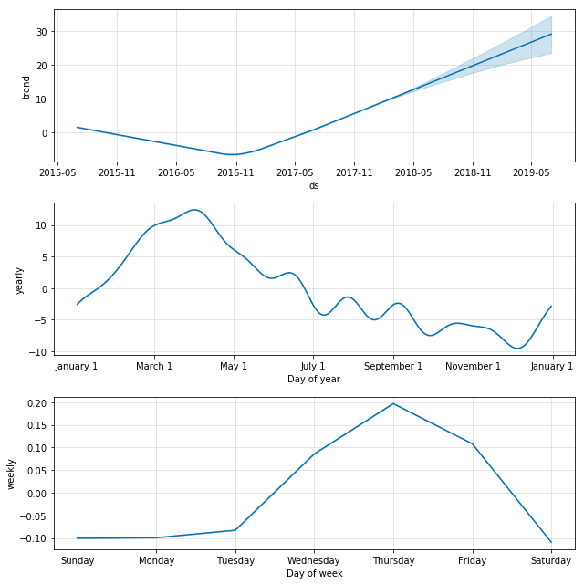


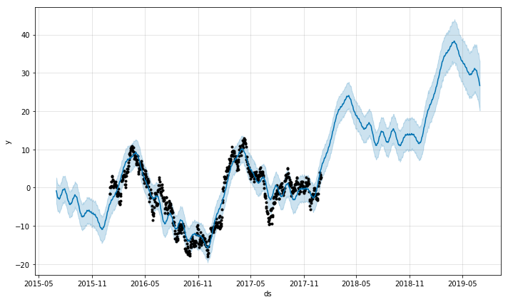


Prophet makes nicer graphs out of the box, for sure. It also has a nice way to show uncertainty. And looking at the above, you might very well believe that indeed we have found some sort of phenomenon that seems to peak in late winter and spring, and on Thursday for some reason. It would be a pretty safe bet to bet that the above trend would peak in the months following the last dataset we have, right? Wrong, of course, because as you know, this dataset was generated entirely randomly. The lesson here is not that this method for modeling seasonality and forecasting is wrong, as indeed they work exactly as they are designed to, but instead that we need to be quite careful not to so readily believe what they say. This is the giant grain of salt I'm putting on your plate before getting to the fun stuff.

To make this point entirely visual, let's do the same analysis as above, but instead of just using two years worth of fake data, let's create three years, but only feed the additive model two years, and see how it does in the third year.


```python
df1 = rwts(365*3)
mask1 = (df1['ds'] >= '20160101') & (df1['ds'] < '20180101')
df2 = df1.loc[mask1]
mask2 = (df1['ds'] >= '20180101') & (df1['ds'] < '20190101')
df3 = df1.loc[mask2]
_m = Prophet(yearly_seasonality = True, daily_seasonality=False,
             weekly_seasonality = True, mcmc_samples = 0, seasonality_prior_scale=50)
_m.fit(df2)
_future = _m.make_future_dataframe(periods=365)
_forecast = _m.predict(future)
_m.plot(_forecast);
```


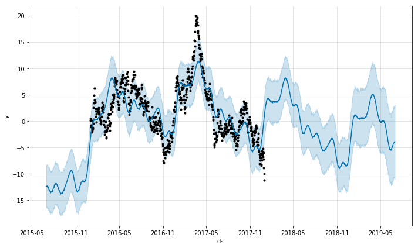


That looks great, that stock is about to go up like crazy, let's dump our entire life-savings into that stock!


```python
_m.plot(_forecast);
df3['y'].plot(color='Red')
```


    <matplotlib.axes._subplots.AxesSubplot at 0x7f7fbe8d1048>


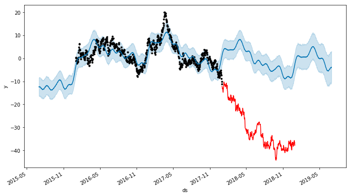


Oops.

## Wikipedia Page hit stats

Previously, in order to get a nice way to access Wikipedia page hit data, I would have suggsted the R library wikipediatrend. The situation has evolved such that wikipediatrend is not functional (see [this link for more details](https://github.com/petermeissner/wikipediatrend/issues/32)). Fortunately, Wikimedia themselves have released an api that has a [python library](https://github.com/mediawiki-utilities/python-mwviews).


```python
from mwviews.api import PageviewsClient

p = PageviewsClient('blog')
```

Although there is a [repository](https://dumps.wikimedia.org/other/pagecounts-raw/) of old pageviews pre-dating July 2015, the API only provides dates from July 2015 forward. Let's get three years worth of data from July 2015 to July 2018. The following command outputs a dictionary with items of the form:

```
 datetime.datetime(2015, 12, 21, 0, 0): {'Lincoln': 503},
```

when we make a call to extract page hit counts for the topic 'Abraham Lincoln'.


```python
dictLincoln = p.article_views('en.wikipedia', ['Abraham Lincoln'], granularity='daily', start='20150701', end='20180701');
```


```python
dfLincoln = pd.DataFrame.from_dict(dictLincoln).transpose()
```


```python
dfLincoln.index = pd.to_datetime(dfLincoln.index)
dfLincoln = dfLincoln.rename(columns={"Abraham_Lincoln": "Daily Page Counts"})
dfLincoln.head()
```


<div>
<style scoped>
    .dataframe tbody tr th:only-of-type {
        vertical-align: middle;
    }

    .dataframe tbody tr th {
        vertical-align: top;
    }

    .dataframe thead th {
        text-align: right;
    }
</style>
<table border="1" class="dataframe">
  <thead>
    <tr style="text-align: right;">
      <th></th>
      <th>Daily Page Counts</th>
    </tr>
  </thead>
  <tbody>
    <tr>
      <th>2015-07-01</th>
      <td>15223</td>
    </tr>
    <tr>
      <th>2015-07-02</th>
      <td>15137</td>
    </tr>
    <tr>
      <th>2015-07-03</th>
      <td>17291</td>
    </tr>
    <tr>
      <th>2015-07-04</th>
      <td>19697</td>
    </tr>
    <tr>
      <th>2015-07-05</th>
      <td>18149</td>
    </tr>
  </tbody>
</table>
</div>


Do we see any trends just by glancing at the plot of these page hits over the three year period from July 2015 to July 2018? Initially we may see a few, such as that the page hits seem to go up after January, and have some unusual peaks in late 2016 and early 2017 (very likely, and precisely as we will see later, related to the election and inauguration of that period).


```python
dfLincoln.plot(title="Abraham Lincoln Wiki Page Hits")
```


    <matplotlib.axes._subplots.AxesSubplot at 0x7f7fc8603a90>


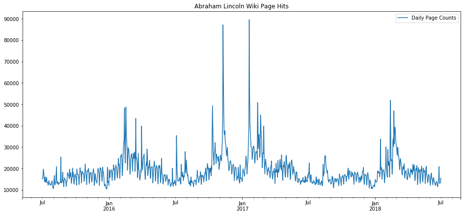


In fact, let's plot key dates on that plot, such as the US election of 2016, inauguration of 2017, President's Day holidays, and the 4th of July. These key dates explain almost all of the spikes.


```python
ax = dfLincoln.plot(title="Abraham Lincoln Wiki Page Hits + Key dates", linewidth=3.0);
important_dates = ['2016-11-08', '2017-01-20', '2016-02-15', '2017-02-20', '2018-02-19',
                   '2015-07-04', '2016-07-04', '2017-07-04', '2018-07-04']
for xc in important_dates:
    plt.axvline(x=xc, color='k', linestyle='--')
ax.set_xlim(pd.Timestamp('2016-01-01'), pd.Timestamp('2018-03-01'))
ax.set_ylim(0, 90000)
```


    (0, 90000)


Next we apply statsmodel's implementation of the additive model for seasonal decomposition:


```python
fig, ax = plt.subplots()
plt.title('Seasonal trend for Wiki Page Counts: Abraham Lincoln')
decompositionm = seasonal_decompose(dfLincoln, freq=365, model='additive')
trendm = decompositionm.trend
seasonalm = decompositionm.seasonal
residualm = decompositionm.resid
plt.subplot(411)
plt.plot(dfLincoln, label='Original')
plt.legend(loc='best')
plt.subplot(412)
plt.plot(trendm, label='Trend')
plt.legend(loc='best')
plt.subplot(413)
plt.plot(seasonalm,label='Seasonality')
plt.legend(loc='best')
plt.subplot(414)
plt.plot(residualm, label='Residuals')
plt.legend(loc='best')
plt.tight_layout()
```


This model has identified a trend increase in election year 2016, which seems to make sense. However, it overfit the spike seen around election day 2016, and we can see the result of that overfit in the residuals which dip extremely a year before and after election day. In a future blog post, we will look at working around this by marking the key dates as holidays so that the algorithm doesn't overfit those days. The seasonality trend has also found something pretty expected, which is that hits on that page seem to breathe with the typical American school year. That is, we can see in the seasonal trends that there are many students using Wikipedia (hopefully as a starting point and not a primary resource) for essay papers and homework answers on Abraham Lincoln.


```python
ax = seasonalm.plot(title="Abraham Lincoln Wiki Page Hits Seasonal Trend + Key dates + Shaded School Year", linewidth=3.0);
important_dates = ['2016-11-08', '2017-01-20', '2016-02-15', '2017-02-20', '2018-02-19',
                   '2015-12-25', '2016-12-25', '2017-12-25',
                   '2015-07-04', '2016-07-04', '2017-07-04', '2018-07-04']
for xc in important_dates:
    ax.axvline(x=xc, color='k', linestyle='--')
ax.axvspan(pd.Timestamp('2015-09-01'), pd.Timestamp('2016-06-01'), facecolor='g', alpha=0.3)
ax.axvspan(pd.Timestamp('2016-09-01'), pd.Timestamp('2017-06-01'), facecolor='g', alpha=0.3)
ax.axvspan(pd.Timestamp('2017-09-01'), pd.Timestamp('2018-06-01'), facecolor='g', alpha=0.3)

ax.set_xlim(pd.Timestamp('2015-07-01'), pd.Timestamp('2018-03-01'))
ax.set_ylim(-10000, 40000)
```


    (-10000, 40000)


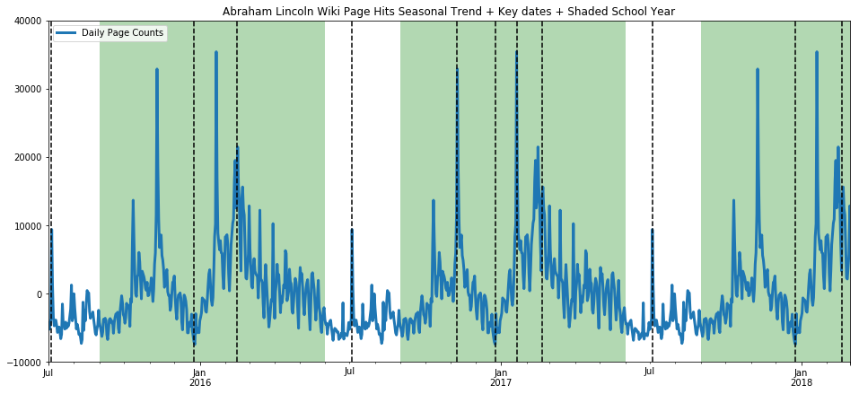


Zooming in on the residuals, we see again how the overfitting to the special events (election and inauguration) hurt the accuracy of the models.


```python
ax = residualm.plot(title="Abraham Lincoln Wiki Page Hits Seasonal Residuals + Key dates", linewidth=3.0);
important_dates = [ '2016-01-20', '2016-11-08', '2017-01-20', '2017-11-08']
for xc in important_dates:
    ax.axvline(x=xc, color='k', linestyle='--')
ax.set_xlim(pd.Timestamp('2015-12-01'), pd.Timestamp('2018-02-01'))
ax.set_ylim(-40000, 40000)
```


    (-40000, 40000)


Now we have stated a hypothesis without backing it up, namely that the seasonality over the year in page hits for the Wikipedia entry for Abraham Lincoln reflects the patterns of the American school year. This is pretty impossible to prove without data that is impossible or not practical to obtain, namely we would have to have the IP addresses of all those page hits and tie those in to schools and households with students, etc. Never going to happen. But we can strengthen our confidence in our hypothesis by testing it in the negative, that is, what will we see if we pick a topic which we do *not* expect to be tied to school-year patterns, a topic students would rarely ever look up for school work? Let's try the American telecom Sprint.


```python
def get_wiki_df(topic, ymin, ymax):
    _dict = p.article_views('en.wikipedia', [topic], granularity='daily', start='20150701', end='20180701');
    _df = pd.DataFrame.from_dict(_dict).transpose()
    _df.index = pd.to_datetime(_df.index)
    _df = _df.rename(columns={topic: "Daily Page Counts"})
    ax = _df.plot(title="{} Wiki Page Hits + Key dates + Shaded School Year".format(topic), linewidth=3.0);
    important_dates = ['2016-11-08', '2017-01-20', '2016-02-15', '2017-02-20', '2018-02-19',
                       '2015-12-25', '2016-12-25', '2017-12-25',
                       '2015-07-04', '2016-07-04', '2017-07-04', '2018-07-04']
    for xc in important_dates:
        ax.axvline(x=xc, color='k', linestyle='--')
    ax.axvspan(pd.Timestamp('2015-09-01'), pd.Timestamp('2016-06-01'), facecolor='g', alpha=0.3)
    ax.axvspan(pd.Timestamp('2016-09-01'), pd.Timestamp('2017-06-01'), facecolor='g', alpha=0.3)
    ax.axvspan(pd.Timestamp('2017-09-01'), pd.Timestamp('2018-06-01'), facecolor='g', alpha=0.3)

    ax.set_xlim(pd.Timestamp('2015-07-01'), pd.Timestamp('2018-03-01'))
    ax.set_ylim(ymin, ymax)
    return _df

def get_wiki_seasonal(topic, ymin, ymax):
    _dict = p.article_views('en.wikipedia', [topic], granularity='daily', start='20150701', end='20180701');
    _df = pd.DataFrame.from_dict(_dict).transpose()
    _df.index = pd.to_datetime(_df.index)
    _df = _df.rename(columns={topic: "Daily Page Counts"})
    decompositionm = seasonal_decompose(_df, freq=365, model='additive')
    seasonalm = decompositionm.seasonal
    ax = seasonalm.plot(title="{} Wiki Page Hits Seasonal Trend + Key dates + Shaded School Year".format(topic), linewidth=3.0);
    important_dates = ['2016-11-08', '2017-01-20', '2016-02-15', '2017-02-20', '2018-02-19',
                       '2015-12-25', '2016-12-25', '2017-12-25',
                       '2015-07-04', '2016-07-04', '2017-07-04', '2018-07-04']
    for xc in important_dates:
        ax.axvline(x=xc, color='k', linestyle='--')
    ax.axvspan(pd.Timestamp('2015-09-01'), pd.Timestamp('2016-06-01'), facecolor='g', alpha=0.3)
    ax.axvspan(pd.Timestamp('2016-09-01'), pd.Timestamp('2017-06-01'), facecolor='g', alpha=0.3)
    ax.axvspan(pd.Timestamp('2017-09-01'), pd.Timestamp('2018-06-01'), facecolor='g', alpha=0.3)

    ax.set_xlim(pd.Timestamp('2015-07-01'), pd.Timestamp('2018-03-01'))
    ax.set_ylim(ymin, ymax)
    return _df
```


```python
ax=get_wiki_df("Sprint", 0, 400)
ax=get_wiki_seasonal("Sprint", -100, 400)
```


The seasonality trend is scarred by incorporating a singular spike in data (the additive model tries to balance bias and variance, but obviously both can break at the same time), but we see no pattern tied to the school year. (One flaw is that the hits on the Sprint wiki page are much lower to begin with, so it isn't as reliable of a statement.) Let's try another topic which we suspect should breathe with the school year, US President George Washington.


```python
ax=get_wiki_df("George Washington", 0, 80000)
ax=get_wiki_seasonal("George Washington", -20000, 60000)
```


The trend here is less pronounced, but still evident. While we are on the topic, we present below, without commentary, a comparison on page hits between Donald Trump and Bill Clinton. I present both on the same scale to show the extraordinary difference in the magnitude of public interest in each individual.


```python
ax=get_wiki_df("Donald Trump", 0, 7000000)
ax=get_wiki_seasonal("Donald Trump", -200000, 5000000)
```


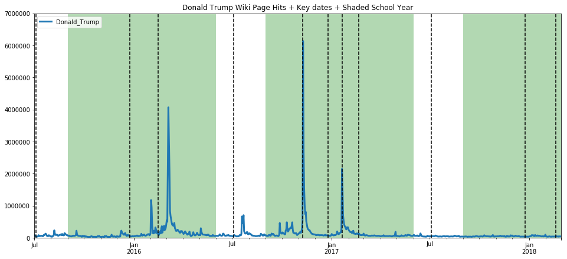


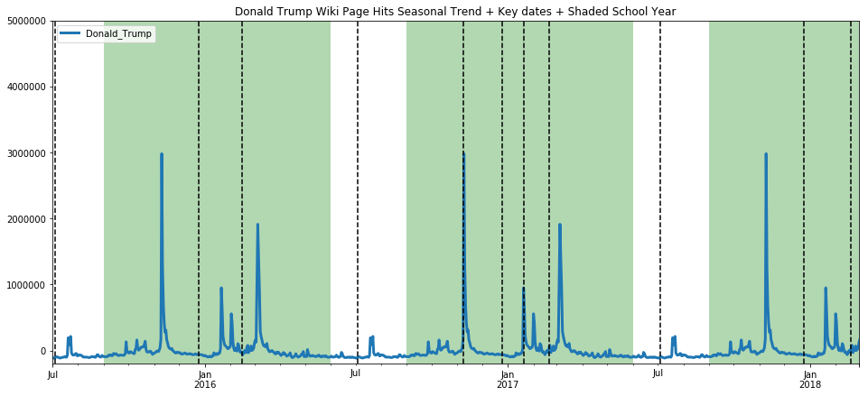


```python
ax=get_wiki_df("Bill Clinton", 0, 7000000)
ax=get_wiki_seasonal("Bill Clinton", -200000, 5000000)
```


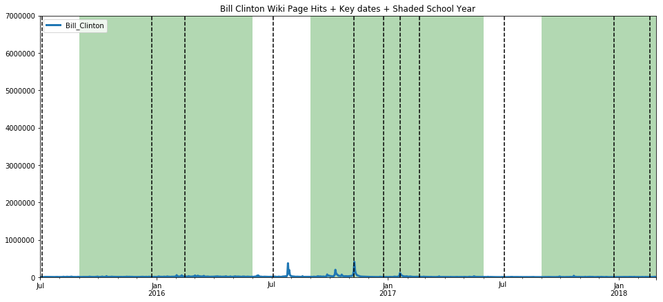


Let's make use of Prophet now, because it has nicer graphs and seems a little more robust in my limited usage so far. We've used it above, but I will walk through a little more slowly this time. First we must create a Prophet object, and fit our dataframe to Prophet such that there is a datetime column labeled ds, and the counts value column is relabeled y.


```python
m = Prophet(yearly_seasonality = True, weekly_seasonality = True, mcmc_samples = 0, seasonality_prior_scale=50)
proLincoln = dfLincoln
proLincoln['ds'] = dfLincoln.index
proLincoln.head()

```


<div>
<style scoped>
    .dataframe tbody tr th:only-of-type {
        vertical-align: middle;
    }

    .dataframe tbody tr th {
        vertical-align: top;
    }

    .dataframe thead th {
        text-align: right;
    }
</style>
<table border="1" class="dataframe">
  <thead>
    <tr style="text-align: right;">
      <th></th>
      <th>Daily Page Counts</th>
      <th>ds</th>
    </tr>
  </thead>
  <tbody>
    <tr>
      <th>2015-07-01</th>
      <td>15223</td>
      <td>2015-07-01</td>
    </tr>
    <tr>
      <th>2015-07-02</th>
      <td>15137</td>
      <td>2015-07-02</td>
    </tr>
    <tr>
      <th>2015-07-03</th>
      <td>17291</td>
      <td>2015-07-03</td>
    </tr>
    <tr>
      <th>2015-07-04</th>
      <td>19697</td>
      <td>2015-07-04</td>
    </tr>
    <tr>
      <th>2015-07-05</th>
      <td>18149</td>
      <td>2015-07-05</td>
    </tr>
  </tbody>
</table>
</div>


```python
proLincoln = proLincoln.rename(columns={'Daily Page Counts': 'y'})
proLincoln.head()
```


<div>
<style scoped>
    .dataframe tbody tr th:only-of-type {
        vertical-align: middle;
    }

    .dataframe tbody tr th {
        vertical-align: top;
    }

    .dataframe thead th {
        text-align: right;
    }
</style>
<table border="1" class="dataframe">
  <thead>
    <tr style="text-align: right;">
      <th></th>
      <th>y</th>
      <th>ds</th>
    </tr>
  </thead>
  <tbody>
    <tr>
      <th>2015-07-01</th>
      <td>15223</td>
      <td>2015-07-01</td>
    </tr>
    <tr>
      <th>2015-07-02</th>
      <td>15137</td>
      <td>2015-07-02</td>
    </tr>
    <tr>
      <th>2015-07-03</th>
      <td>17291</td>
      <td>2015-07-03</td>
    </tr>
    <tr>
      <th>2015-07-04</th>
      <td>19697</td>
      <td>2015-07-04</td>
    </tr>
    <tr>
      <th>2015-07-05</th>
      <td>18149</td>
      <td>2015-07-05</td>
    </tr>
  </tbody>
</table>
</div>


```python
m.fit(proLincoln)
```

    INFO:fbprophet.forecaster:Disabling daily seasonality. Run prophet with daily_seasonality=True to override this.
    /home/d7082791602/.local/lib/python3.6/site-packages/pystan/misc.py:399: FutureWarning: Conversion of the second argument of issubdtype from `float` to `np.floating` is deprecated. In future, it will be treated as `np.float64 == np.dtype(float).type`.
      elif np.issubdtype(np.asarray(v).dtype, float):


    <fbprophet.forecaster.Prophet at 0x7f7fbdf32cc0>


```python
future = m.make_future_dataframe(periods=365)
forecast = m.predict(future)
forecast.head()
m.plot_components(forecast);
m.plot(forecast);
```


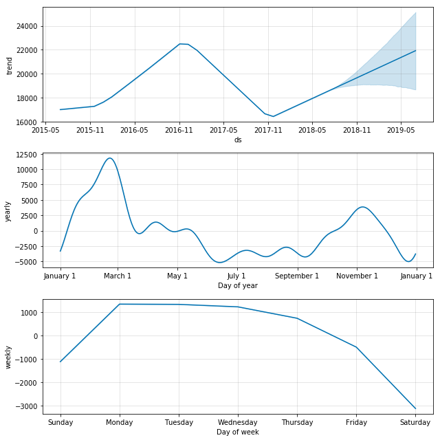


Here we see that prophet also very nicely picks out the 2016 trend, and clearly picks out the school year trend as well as the weekday trend. In order to make these quick peaks at the data more systematic, we create and use the following function. We then use these functions to take a look at a varied array of Wikipedia pages and conjecture a bit about the results.

The first one we take a look at is "Christmas" which we expect, and indeed find, has a very clean seasonality. Note the weekday trend line shows a preference for some days over others, which is an artifact simply of which day the holiday fell on in the years that are used for training (since this holiday doesn't fall on any particular weekday by design, and we only trained based on three years, those three days in occured on, or rather Christmas Eve, will see the bias. That would be Thursday/Friday 2015, Sunday/Monday 2016, and Monday/Tuesday 2017 [2016 was a leap year]).


```python
def prophet_wiki_df(topic, starting='20150701', ending='20180804'):
    _m = Prophet(yearly_seasonality = True, daily_seasonality=False, weekly_seasonality = True, mcmc_samples = 0, seasonality_prior_scale=50)
    _dict = p.article_views('en.wikipedia', [topic], granularity='daily', start=starting, end=ending);
    _df = pd.DataFrame.from_dict(_dict).transpose()
    _df.index = pd.to_datetime(_df.index)
    _df.plot(title="{} Wikipedia Page Hit Counts".format(topic))
    _df = _df.rename(columns={topic.replace(" ", "_"): "y"})
    _df['ds'] = _df.index
    _m.fit(_df)
    _future = _m.make_future_dataframe(periods=365)
    _forecast = _m.predict(future)
    _m.plot_components(_forecast);
    _m.plot(_forecast);
```


```python
prophet_wiki_df('Christmas')
```


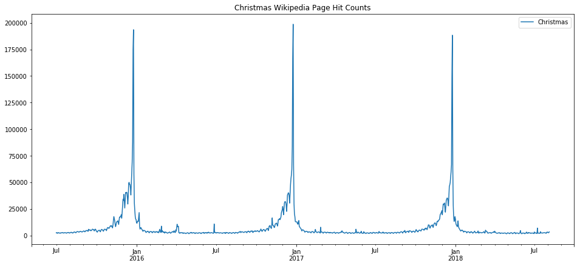


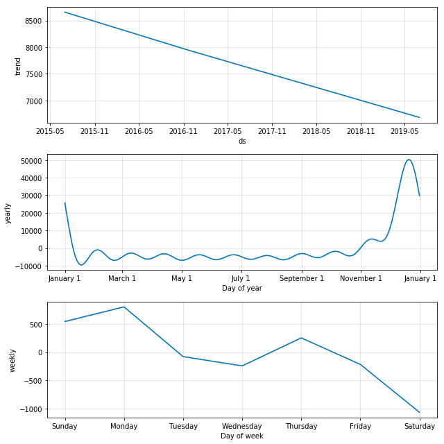


Now let's look at something that shouldn't really have too much seasonality, the term eclipse. Eclipses happen on a regular basis, of course, and physics predicts them extremely accurately, but human observation of eclipses happens irregularly. Here we can see that the major eclipse event of 2017 is so strongly represented in the data that it ends of defining the very inacurate model that results.


```python
prophet_wiki_df('Eclipse')
```


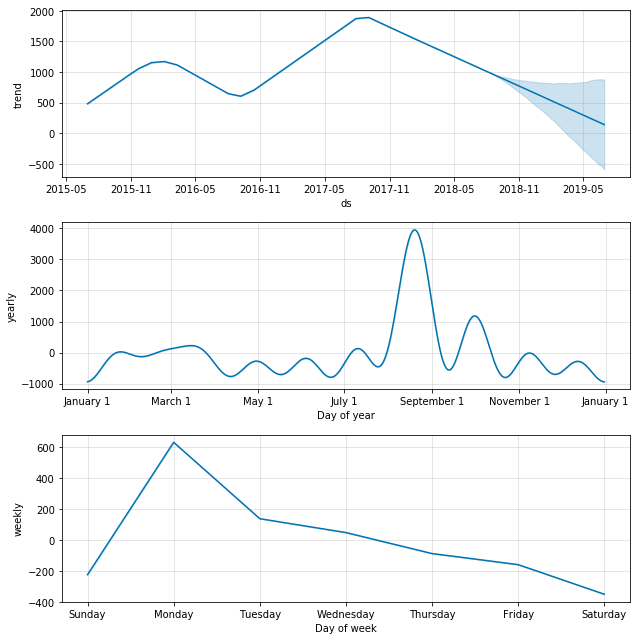


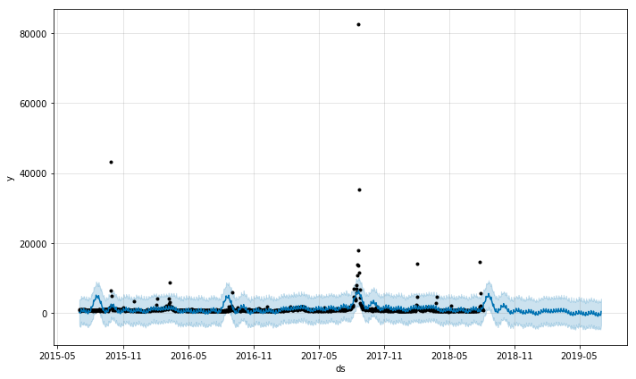


We can see the fading of pop culture stars, such as the declining trend with Beyonce. Again, we see that the none of the output here is very trustworthy except perhaps the overall trend. Events such as awards ceremonies, album releases, and gossip events result in spikes which then dominate the seasonality models.


```python
prophet_wiki_df('Beyoncé')
```


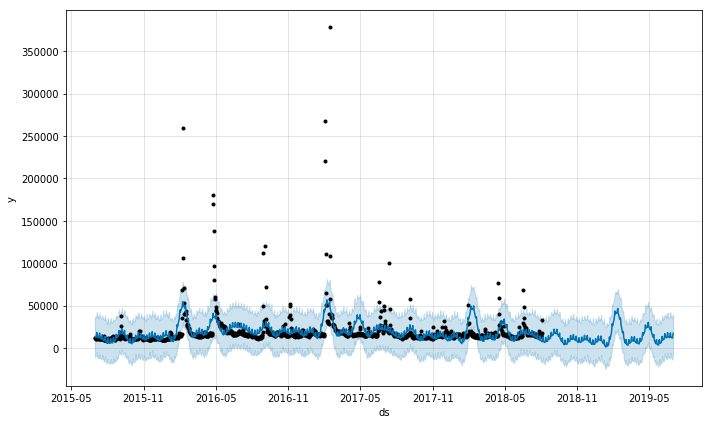


Returning to our theme above that some wiki topics breathe with the school year, electron is surely one of those topics.


```python
prophet_wiki_df('Electron')
```


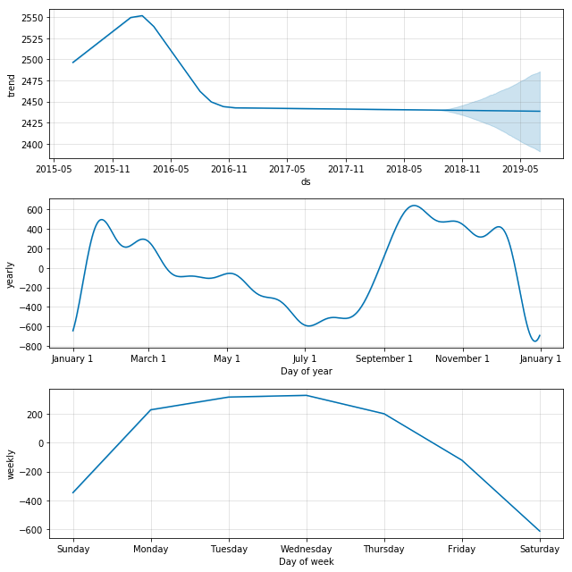


## Conclusions

Statistical tools for seasonal decomposition are a great start in trying to predict time series which have some predictability built in. For topics that have a much greater stochastic characteristic, these tools become much more difficult to use properly. Blog entries here will continue to explore these tools and go into greater detail about the math behind them and how to use the tools in more sophisticated ways. Initial impressions from this exploration here:

* There are some time series which are nearly perfectly predictable, such as that for the page hits on the topic of Christmas, which is an event that happens once per year and is limited in scope to a small minority of weeks in the entire year.

* Other trends are fairly predictable, such as electron, because of its association with school work and the predictable seasonality of school. Interestingly, the trends one finds with topics like this show the "hit" that the holiday break seems to have on education, where the end of year break is preceeded with a sort of winding down and then followed by a winding up, both of which are not particularly rapid.

* Trends that have an educational component, such as popular US Presidents like Abraham Lincoln, are complicated by holidays such as president's day, elections, and inaugurations.

* Trends from pop culture, such as Beyonce, can possibly trace the popularity of a celebrity but, are complicated by things such as album releases, awards ceremonies, gossip outbreaks, etc.

* Sometimes, a massive surge in interest in a topic due to some even can entirely throw off seasonal decomposition, and such events will have to be 'windowed out' and interpolated to get an accurate picture of the routine behavior of the time series.

* Some topics show the decline in interest in the topic in general, or in some cases, an increasing normalization of a topic such that it gets less page views over time.

* Some topics are so random that speaking about trends and seasonality is nonsense. However, these models can easily overfit that data and give you a false sense of confidence that will inevitably be proven wrong.
