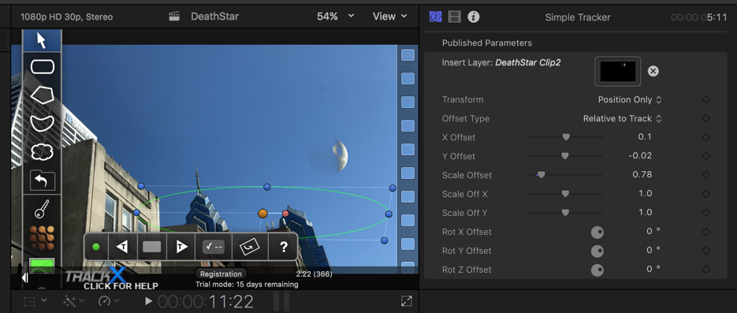

## Quick overview

* If interested in creating special effects for film projects.
* Uses Final Cut Pro X and CoreMelt's TrackX Plugin's Simple
Tracker.
* In about thirty minutes you can create a passable video that portrays the Star War's Death Star over Philadelphia, PA USA.
* Resulting video:

<iframe width="560" height="315" src="https://www.youtube.com/embed/it_wj78IbFA" frameborder="0" allowfullscreen></iframe>

## Gathering the Software

I'll begin with an apology that the software discussed here requires Apple Mac* hardware to run. What we do here can be done with Adobe Premier Pro right out of the box.

Assuming you have a Mac* device, this project also requires
[Final Cut Pro](https://itunes.apple.com/us/app/final-cut-pro/id424389933?mt=12). This is not cheap software, but I've found it to be worth it if you plan to be doing enough projects. I have many nieces and nephews and we've had an awesome time making movies with this tool.

Using Keyframing, we could get a realistic tracking effect, but this would be a very tedious and time consuming way to proceed. Fortunately there is a plugin we can use that does the tracking nearly automatically.

[Coremelt's TrackX Plugin](https://coremelt.com/products/trackx-powered-by-mocha) powered by [Mocha](https://www.imagineersystems.com/products/what-is-mocha/) analyzes your video frame by frame and attempts to match the motion of the camera. The user needs only provide some very simple guidance.

## Gathering the Media

A quick image search will yield a wide range of choices for images of a space station, in this case the Death Star, but keep an eye towards an example that would look realistic in the
context of your video. I chose an image that looked a lot
like what the moon looks like in the daytime.

I also filmed a couple of scenes around Philadelphia,
being careful to move the camera enough to make it
seem realistic, but smoothly enough with no quick
motions to make tracking easier for myself.

## Preparing the Death Star image

When you apply the image, however, you also must keep
in mind that if it doesn't match the shadowing seen in
the video, the viewer's mind will feel a bit off about it.
Look for the shadows in your video and flip the Death Star
image to match that direction using the _flipped_ effect:

That is, import the media, drag it down to your timeline, and then drag the _flipped_ effect to the corresponding timeline entry of the Death Star image. Next right click on that
clip and create a new compound clip:

This is required for the TrackX plugin. Once you've done
that, the compound clip of the Death Star will show up
in your media and you can delete from your time line.

Because I had one scene facing West and another facing East,
which is not recommended because that would imply two
Death Stars in the sky, I needed to create two compound
clips, one flipped from the other, in order to match
the sun direction.

## Tracking your video clips

Next we can start the tracking process. Import your video
clips from your device or hard-drive and then drag the
corresponding file from the media section onto the timeline.

Then, go to the _generators_ menu and select Simple Tracker
under the C2 TrackX entry:

Drag that __on top of__ the video clip. Your timeline
will look something like this:

Above, I have three video clips and I have trimmed
the Simple Tracker to fit each one and thus have three
Simple Tracker entries in the timeline, one for each video.

Click on the Simple Tracker entry on the timeline and you'll
now be able to set up tracking for your video:

Figuring out what shape and placement for your area selection
in Simple Tracker is an art more or less. Be sure to select
an area that is completely in view for the majority of the clip.
In the above screenshot, I chose the top of two sky-scrapers that are clearly and consistently within view during the entire
clip. This helps the tracker maintain a passable tracking.

Drag your compound clip of the Death Star that you made
in the previous step over to the Insert Layer section, and
then adjust the X, Y offsets and scale until the image placement
in your video looks satisfactory.

In the timeline, move to the start of the
video, and after you set your tracking shape selection,
click on the _Track forward_ button (white sideways arrow
with the T in it). The plugin will iterate through each
frame attempting to track the camera location in
such a way that it can superimpose an image of the Death
Star on the sky so that it appears as if it is stationary
relative to the camera. In the resulting video (above)
you can see, if you look closely enough, some flaws, but
for the relatively small time put into it, the effect
is quite good.

## Tutorial Video

Finally, here is a quick how-to video walking you
through the process in real-time:

<iframe width="560" height="315" src="https://www.youtube.com/embed/se17wSZzKB8" frameborder="0" allowfullscreen></iframe>

## Further references

[Another example of this plugin](https://www.youtube.com/watch?v=bfhRtd1z2PY)

[Using Adobe to create this effect](https://www.youtube.com/watch?v=NYfMugEz2zA)
