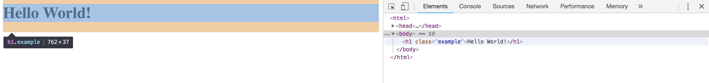

Testing software can often be seen as the least enjoyable part of the
[systems development life cycle](https://en.wikipedia.org/wiki/Systems_development_life_cycle).
It is easy to see why. Developing the actual application that does the magic
that the end user finds value in is indeed a very exciting core to the process.
And yet, what you produce could be worthless if it doesn't work for the user.

So let's say you are working on an individual pet project. The fun part is
coding it up and getting it to do something. Here, I'm going to use a simple
*Flask* app that serves up some Wikipedia page count stats as an example.
As a developer adds layers and new features and new bells and whistles and
pipes and extension cords to their project, things which they
haven't developed in months or years can break, and if they don't have a good testing
suite in place, they won't catch it and will serve out a degraded experience.
That's a dis-service to their users, but even to themselves, whose hard work
has gone to waste because that piece of the project, which they might have
spent many hours working on, might as well not even exist if it doesn't work.
Worse yet, if they break their app entirely, it could take hours and hours
of searching for a bug.

If instead there is a systematic testing suite in place,
each incremental change can be subjected to a battery of tests that help ensure
that it is safe to continue to the next incremental change. This _should not_ be
the developer clicking through their app and making sure everything looks good.
There are many awesome tools in place that allow for quick automated testing.
Here, we provide a walk through to jump start a web developer on using Python
 and the selenium and behave libraries to provide a full browser test of their site.

## Selenium

Selenium is a Python library that automates testing the final product of
a webpage. Selenium integrates with various browsers and replicates
the behavior that you expect from your users, all while measuring the
response to that behavior against your expectations for how the site, when
in its optimal state, should respond.
It is as easy to install as

```bash
pip install selenium nose behave
````

Let's start with a very simple example. Suppose you have webpage that
simply serves this up:

```html
<html>
    <head>
        <title>WikiViz</title>
    </head>
    <body>   
        <h1 class="example">Hello World!</h1>
    </body>
</html>
```

Even if you didn't want to get fancy and set up a nice file structure and
orchestrate your testing with tools such as `behave` and `nose`, you
could simply create a very straight-forward python script that runs
the selenium testing you need to ensure that your page is serving
the expected content.

If you are running these locally on your laptop, the following
step isn't necessary, you will just need to make sure you have
Firefox installed. Selenium works with other browsers, but
to keep this simple at first, we will focus on Firefox.

### Headless on Ubuntu (skip this if using a Mac)
Skip this section if you don't plan to run this on a remote
linux-based server. In this example, I'm using my Cloud 9 IDE
account which serves up containers with Ubuntu as the OS.

First we need to isntall the [Xvfb](https://en.wikipedia.org/wiki/Xvfb) package:

```bash
sudo apt-get install firefox xvfb
```
and the PyVirtualDisplay python library:

```bash
pip install selenium nose behave PyVirtualDisplay
```
Finally, you'll need the [geckodriver](https://github.com/mozilla/geckodriver/releases)
(they don't include md5sums or rsa hashes to confirm authenticity, but use github
to host and release which comes with a great deal of trust):

```bash
wget https://github.com/mozilla/geckodriver/releases/download/v0.21.0/geckodriver-v0.21.0-linux64.tar.gz
tar zxvf geckodriver-v0.21.0-linux64.tar.gz
chmod a+x geckodriver
sudo mv geckodriver /usr/local/bin/
```

### Our first selenium assertion

Now we are ready for our first test. This test will
do two things. First, it will cause selenium to try
to access the webpage. If it can't do so, it will fail.
This means that a selenium tests automatically tells
you whether or not your page is up and running right
out of the box. Secondly, the test will assert that
the very simple webpage example shown above is setting
the title to 'WikiViz' as it should be.

If you are using the headless on your remote server,
your code will look like this:


```python
#!/usr/bin/env python

from pyvirtualdisplay import Display
from selenium import webdriver

display = Display(visible=0, size=(1000, 1000))
display.start()

driver = webdriver.Firefox()
driver.get('http://localhost:8080/')
assert driver.title == 'WikiViz'
driver.quit()

display.stop()
```

If you are running this in a local environment, such as on
a Mac, and you like to watch selenium open the browser and
walk through the tests, then your code would look like this:

```python
from selenium import webdriver

base_url = "http://localhost:8080"
driver = webdriver.Firefox()
driver.get(base_url)

assert driver.title == "WikiViz"
```

Yes, it is that easy! OK, well, at least for the title. As
your page gets more complicated, so will your testing, but
overall the spirit of simplicity in the selenium testing scheme
carries over. It's the complexities of html/javascript that
you will eventually need to worry about. But we will keep things
simple here.

### Expanding the tests

In order to make our example just a little more
interesting, and give selenium something to _do_ rather than
just _observe_, let's add a button to our simple home page
that takes us to another page. Add the following just after
the h1 entry:

```
<form>
  <input type="button" value="results" onclick="window.location.href='/results'" />
</form>
```

In this next section, I'm going to make the tests a little more
complicated in structure, but for a good payoff. If you like to
keep your tests in a single script as above, you can simply expand
on that script. Here, I will show a simple example using `nose`
and `behave` libraries. This example was inspired by a slightly more
complicated (and well done) example (which doesn't have the headless feature)
[here](https://the-creative-tester.github.io/Python-Web-Browser-Automation-Behave/),
but meant to be easier to dive into for those new to testing with selenium.

Create a file structure that looks as follows:

```bash
(env) tdj28:~/workspace/selenium_tests (master) $ tree .
.
├── features
│   ├── __init__.py
│   ├── pages
│   │   └── __init__.py
│   └── steps
│       └── __init__.py
└── simple_examples
    └── xvfb_example.py
```

here's some bash to make that happen:

```bash
mkdir -p selenium_tests/features
mkdir selenium_tests/pages
mkdir selenium_tests/steps
mkdir selenium_tests/simple_examples
touch selenium_tests/features/__init__.py
touch selenium_tests/pages/__init__.py
touch selenium_tests/steps/__init__.py
```

The `simple_examples` directory is where I put in some simple scripts
for testing a few features (or writing this blog post), but you definitely
don't want something that sloppy in a production version of your code.

(Google `init python files` if you don't know what those `__init__.py` files
are for.)


### Step One: Define the Behavior

BDD development would have us define behaviors we expect of the site before
we even begin to develop site. That's a good place to start for selenium testing
as well, where if these definitions are pre-existing, we can use them as our starting
point. If not, we can easily create our own.

In the `features` directory, create a file called `clickbutton.feature` with
the following content:

```
Feature: ClickButton

  Scenario: Click Away From Homepage
    Given I navigate to the Home page
    And I see that the pagename is WikiViz
    And I see the header "Hello World!"
    When I click the button
    Then I see that the pagename is no longer WikiViz
```

This is the beauty of the `behave` library and behavior based testing in general.
We can use everyday language to describe our user's experience, and then translate
that in to tests as we will see shortly. This enables non-technical folks to
contribute tests.

Note that in the above tests, the last line entry is a bit of a cheat on my part.
The test really should, in that line, confirm in some way that it made it to the
results page. So don't do what I did there! If for example you click on the button
and it takes you to a 404 error page, your test will still pass. I take that shortcut
here only to keep this jump start example focused on a single simple html page.

### Step Two: Turn the Behaviors Into Steps

In the steps folder, create a file called `clickbutton_step.py`. Note that
it has the same prefix `clickbutton` as the corresponding features file we
created above, that is required for each feature file. The contents of this
file will have:

```python
from nose.tools import assert_equal, assert_not_equal, assert_true
from selenium.webdriver.common.by import By

@given('I navigate to the Home page')
def step_impl(context):
    context.home_page.navigate("http://localhost:8080/")

@given('I see that the pagename is WikiViz')
def step_impl(context):
    assert_equal(context.home_page.get_page_title(), "WikiViz")

@given('I see the header "Hello World!"')
def step_impl(context):
    assert_equal(context.home_page.get_page_header(), "Hello World!")

@when('I click the button')
def step_impl(context):
    context.home_page.click_button()

@then('I see that the pagename is no longer WikiViz')
def step_impl(context):
    assert_not_equal(context.home_page.get_page_title(), "WikiViz")
```

So the pattern here is starting to become clear:

```
User experience ---> Steps ---> Page functions
```

We have chosen to create the steps before the page functions here because that is
a natural way to proceed. The steps will tell you what functions you need to create,
and then afterwards, create those functions with the narrow scope defined by
the steps.

### Step Three: Turn the Steps Into Implemented Functions

Let's stick with our simple home page as detailed above. We
can look behind the curtain of this page by using our browser's
developer console. On Chrome, for example, it is in settings > More Tools >
Developer Tools. This gives you many great tools to inspect
the code and help you locate elements in your code. For our
simple example, that isn't so necessary, but as this example
is expanded to include javascript which makes the page more dynamic,
these developer tools become very useful. In this screenshot below,
for example, we see how it helps us identify elements of the code.



These elements become key as we find key elements to use in our
testing.

In the pages folder, create a file called `home_page.py` with the following content:

```
from selenium.webdriver.common.by import By
from browser import Browser


class HomePage(Browser):
    # Home Page Actions

    def navigate(self, address):
        self.driver.get(address)

    def get_page_title(self):
        return self.driver.title

    def get_page_header(self):
        return self.driver.find_element_by_class_name("example").text

    def click_button(self, *locator):
        self.driver.find_element_by_class_name("button").click()
```

Because the source code of our simple page assigns the first and only
h1 header by giving it the class "example", that makes it easy
to `find_element_by_class_name`. If in fact we had multiple h1 elements
with that class, we would have to use the plural `find_elements_by_class_name`
instead, which returns a list that we could submit for testing (e.g.
we would know what the first h1 should be, the second, etc.).

So for our homepage, we have created the HomePage class, which inherits the
Browser class we created previously, and we define the actions we will
need on this page for testing. When we add other pages to our example
web app in later blog entries, we will create a new file in the pages
folder, one for each page. In this way, we keep the details nice and cleanly
compartmentalized. If we have a subset of pages that share much in common,
we can create a class for that subset, and then have individual pages
inherit that class, and so on.

Also note that there are multiple ways we can identify elements, including
`xpath`. In this file, we add four tools associated with our homepage.
The first is a navigate function, the second returns the pagename,
the third returns the h1 element, and
the fourth clicks on the button we just added that will send us to a new page.

### Step Four: Define The Browser

Before we can make use of the defined behaviors and expectations,
we need to set up our browser and display (for headless).

Create the file `features/browser.py` with the following content
if you want selenium to run on your laptop or desktop in a way
that you can watch it run through the tests:

```python
from selenium import webdriver

class Browser(object):

    driver = webdriver.Firefox()
    driver.implicitly_wait(15)
    driver.set_page_load_timeout(10)
    driver.maximize_window()

    def close(context):
        context.driver.close()
```

Here, I've made the page timeout ten seconds
because if my page is taking longer than ten seconds to load,
to me that is a pretty good reason for it to fail. I would actually
recommend you being more generous than not, and instead build in timing
features to test for load time rather than have the tests timeout as
an indication that your page is slow, but again, this is meant to be
a baseline example.

For those wishing to use headless testing (on a remote server, no live
browser to watch), the above file will look like:

```python
from selenium import webdriver
from pyvirtualdisplay import Display  # Comment this out for live browser


class BDisplay(object): # Comment this out for live browser
    display = Display(visible=0, size=(1000, 1000))  # Comment this out for live browser
    display.start()  # Comment this out for live browser

    def stop(context): # Comment this out for live browser
        context.display.stop() # Comment this out for live browser


class Browser(object):

    driver = webdriver.Firefox()
    driver.implicitly_wait(15)
    driver.set_page_load_timeout(10)
    driver.maximize_window()

    def close(context):
        context.driver.close()

```


### Step Five: Putting it all together

Finally, we need to have an environment definition to tie everything together.
This will tell `behave` what page classes to import and tell it what to
do before and after the tests are ran.

If the `features` folder, create a file called `environment.py` with the content:

```python
from selenium import webdriver
from browser import BDisplay # Comment this out for live browser
from browser import Browser
from pages.home_page import HomePage


def before_all(context):
    context.display = BDisplay() # Comment this out for live browser
    context.browser = Browser()
    context.home_page = HomePage()


def after_all(context):
    context.browser.close()
    context.display.stop()  # Comment this out for live browser
```   

In the folder above features, assuming you've installed `behave` via pip already,
simply run `behave`. If all goes well, we get an output that indicates the tests
ran and their pass/fail status:

```bash
(env) tdj28:~/workspace/selenium_tests (master) $ behave
Feature: ClickButton # features/clickbutton.feature:1

  Scenario: Click Away From Homepage                  # features/clickbutton.feature:3
    Given I navigate to the Home page                 # features/steps/clickbutton_steps.py:4 0.112s
    And I see that the pagename is WikiViz            # features/steps/clickbutton_steps.py:8 0.005s
    And I see the header "Hello World!"               # features/steps/clickbutton_steps.py:12 0.046s
    When I click the button                           # features/steps/clickbutton_steps.py:16 0.112s
    Then I see that the pagename is no longer WikiViz # features/steps/clickbutton_steps.py:20 0.009s

1 feature passed, 0 failed, 0 skipped
1 scenario passed, 0 failed, 0 skipped
5 steps passed, 0 failed, 0 skipped, 0 undefined
Took 0m0.283s
```

### Find the code here

For your convenience, the selenium code is
collected [here](https://github.com/tdj28/wikiviz_demo_selenium/tree/20180826).
