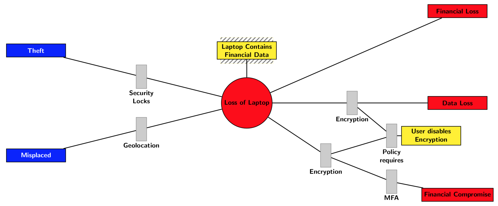

### Bowtie Diagram in LaTeX

For folks who have to conduct risk analysis, there are
very limited choices for the creation of "bowtie diagrams".
Searching the web for examples in LaTeX comes up pretty empty.
So when googling comes up empty, its time to create:

[Bowtie diagram in LaTeX example](https://github.com/3implieschaos/latex-demos/blob/master/figures/bowtie/bowtie.tex)

This code results in a diagram that looks pretty acceptable
in terms of quality, or at least an acceptable starting point:

